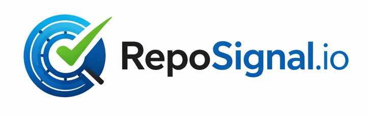

<p align="center">
  
</p>

# RepoSignal

**Your repo already knows what breaks. We show you.**

RepoSignal learns your repository's actual failure history and flags pull requests that match patterns that previously caused problems.

Not generic rules.
Not static analysis.
**Your codebase. Your outcomes.**

---

## What it does

On every PR, RepoSignal:

- Analyzes the actual diff (not the whole repo)
- Detects structural and security patterns
- Compares against your repo's historical revert behavior
- Tells you how to use the signal

---

## What makes it different

Most tools treat every repo the same. RepoSignal doesn't.

It determines what kind of signal your repo actually supports:

### 🔴 Strong Signal (Alert Mode)
- High-confidence patterns
- Safe for focused review and optional gating
- "Review the top 20% of commits, catch 66% of later-corrected commits"

### 🟠 Moderate Signal (Prioritize Mode)
- Real signal, useful for ranking
- Use to prioritize review effort
- Not recommended for blocking merges

### 🟡 Low Signal (Context Mode)
- No strong historical pattern
- Structural + security findings only
- No fake predictions

> RepoSignal tells you when NOT to trust it.

---

## Installation

```yaml
# .github/workflows/reposignal.yml
name: RepoSignal
on:
  pull_request:
    types: [opened, synchronize]

permissions:
  pull-requests: write

jobs:
  reposignal:
    runs-on: ubuntu-latest
    steps:
      - uses: RepoSignal-io/reposignal-action@v1
        with:
          api-key: ${{ secrets.REPOSIGNAL_API_KEY }}
```

1. Get an API key at [reposignal.io](https://reposignal.io)
2. Add it as a repository secret: Settings → Secrets → `REPOSIGNAL_API_KEY`
3. Add the workflow file above
4. Open a PR — RepoSignal posts a comment with findings and risk context

---

## How it works

1. **First run** — predicts your repo's signal strength, provides scanner findings
2. **Calibration** (~15 minutes) — analyzes ~20,000 commits, learns your repo's revert patterns
3. **Every PR** — gets a calibrated, repo-specific comment

---

## Example PR Output

**Alert-mode repo:**
> 🔴 RepoSignal: High-Risk Change
>
> If you reviewed the top 20% of commits like this one, you would have caught **66%** of commits that were later corrected on this repo.

**Prioritize-mode repo:**
> 🟠 RepoSignal: Elevated Risk — Review Recommended
>
> Risk scores are useful for ranking review effort. Not recommended for blocking merges.

**Context-mode repo:**
> 🟡 RepoSignal: Scanner Findings — No strong historical risk signal for this repository. Use code scan findings and manual review as primary signals.

---

## Inputs

| Input | Required | Default | Description |
|-------|----------|---------|-------------|
| `api-key` | Yes | — | Your RepoSignal API key |
| `api-url` | No | `https://reposignal.onrender.com` | API endpoint |
| `threshold` | No | `0` | Score threshold to fail the check (0 = never fail) |

**Note on thresholds:** Only for alert-mode repos. RepoSignal disables thresholding automatically on prioritize and context repos. You can't accidentally break your CI with a low-confidence score.

---

## Pricing

Per repo, per month. Based on signal strength — you pay for the value your repo receives. Hard caps on everything.

| | Free | Pro | Team |
|---|---|---|---|
| **Alert-mode repo** | — | $149/repo/mo | $249/repo/mo |
| **Prioritize/Context repo** | $0 | $79/repo/mo | $149/repo/mo |
| **Max repos** | 1 | 10 | 50 |
| **Included analyses/repo** | 15 total | 500 | 2,000 |
| **Overage (alert)** | Blocked | $0.25/analysis | $0.20/analysis |
| **Overage (prioritize/context)** | Blocked | $0.15/analysis | $0.10/analysis |
| **Max analyses/repo/mo** | 15 | 2,500 | 10,000 |
| **Calibrated risk scoring** | — | ✓ | ✓ |
| **Recalibration** | — | On request | Monthly |
| **Support** | Community | Email | Priority email |

Full pricing details: [reposignal.io](https://reposignal.io)

---

## When to use RepoSignal

- Teams reviewing 100+ PRs/month
- Repos where review prioritization matters
- Engineering orgs that want signal, not noise

## What it is NOT

- Not a linter
- Not a static analyzer
- Not a generic "AI code tool"

It is a **repository-calibrated decision system**.

---

## Security & Privacy

Diffs are processed and discarded. No source code is stored, logged, or shared. Only statistical model weights (numerical values, not code) are persisted for calibration.

## Terms of Use

By using RepoSignal, you agree to the following:

- **No resale.** You may not resell, sublicense, or redistribute RepoSignal's analysis as part of another product or service.
- **No white-labeling.** You may not remove RepoSignal branding or present analysis results as your own service.
- **No proxy access.** You may not provide access to RepoSignal through an intermediary service or API wrapper serving third parties.
- **Single entity.** Each subscription covers one legal entity. Sharing credentials across organizations is prohibited.
- **Fair use.** Automated bulk analysis, competitive benchmarking, or systematic data extraction requires written authorization.
- **Abuse.** RepoSignal reserves the right to suspend accounts that violate these terms.

Full terms at [reposignal.io/terms](https://reposignal.io/terms).

## License

MIT — applies to the GitHub Action integration code only. The RepoSignal analysis engine, models, and API are proprietary.
